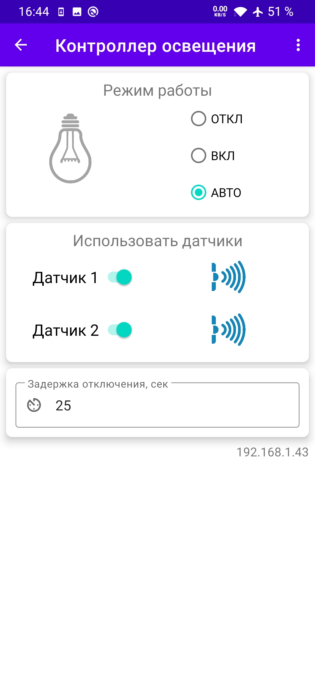
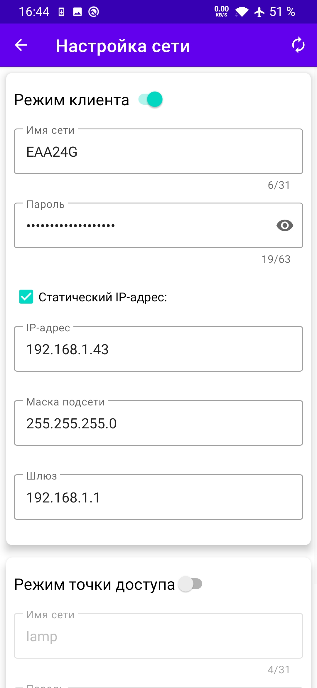

## ESP Manager
------------
ESP Manager — приложение для управления контроллером освещения. Приложение автоматически обнаруживает доступный в локальной сети контроллер.

#### Функционал контроллера:
- Автоматический режим работы:
   - автоматическое включение реле при срабатывании одного из датчиков движения;
   - автоматическое отключение реле по истечении заданного времени при отсутствии движения.
- Режим ручного управления.
- Управление через приложение:
   - выбирать режим работы автоматический или ручной,
   - включать/отключать реле,
   - задействовать один или оба датчика движения,
   - изменять время выдержки до автоматического отключения реле.
- Ведение и сохранение статистики работы реле:
   - суммарное количество включений реле,
   - суммарное время работы реле в состоянии включено,
   - продолжительность непрерывной работы контроллера, с момента подачи на него напряжения,
   - максимальное время непрерывной работы реле в состоянии включено, с момента подачи на него напряжения.
   - Логирование в файл времени включения реле с фиксацией времени и номера датчика движения по которому произошло срабатывание.
------------
#### Используемые технологии:
- Websocket сервер (порт: 81) на устройстве для обмена коммандами и данными между страницей в web-браузере и контроллером;
- mDNS-сервис на устройстве для автоматического определения IP-адреса устройства в сети;
- NTP-клиент для синхронизации времени с сервером времени через интернет;
- MQTT-клиент для удаленного облачного управления с помощью приложения Android;

------------

|  |  |  |  |
|---|---|---|---|
